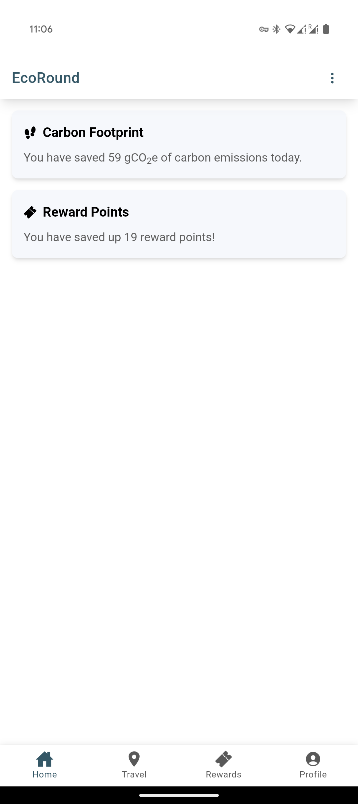
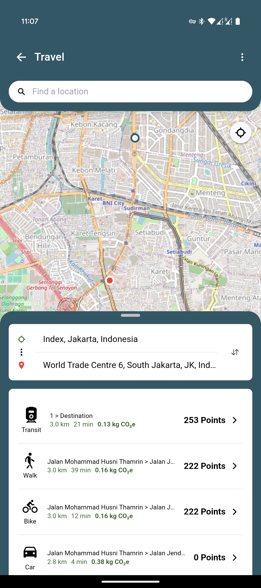
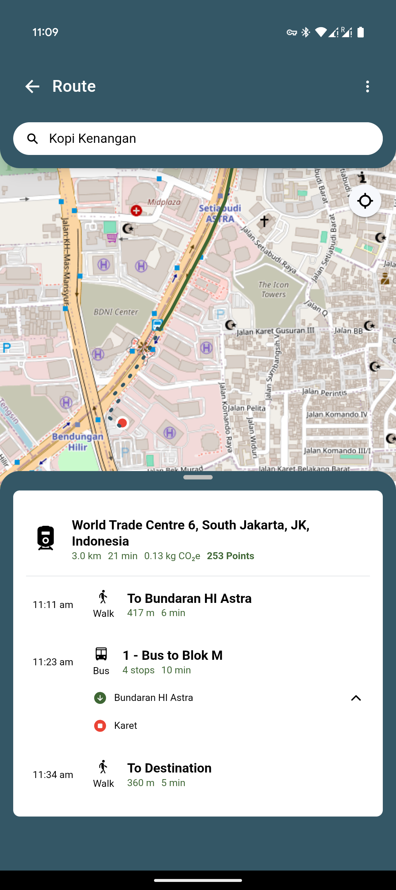
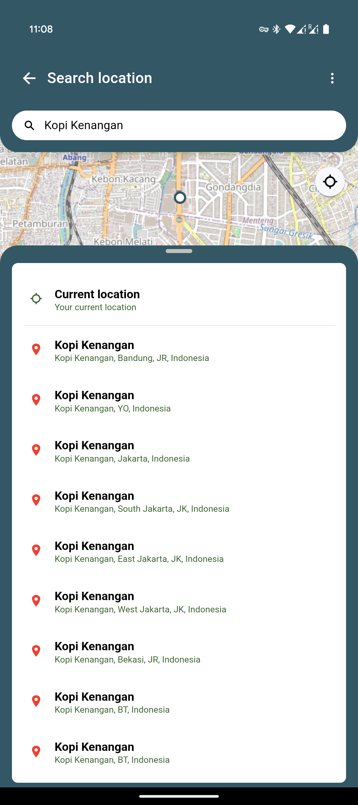

# EcoRound | Climate Hack 2024

A mission to reduce CO<sub>2</sub> emissions by encouraging public transportation usage and other sustainable transportation options like walking or cycling. By tracking users’ carbon footprint, users can earn reward points that can be redeemed for goods and services from vendor partners.

Development currently based for Jakarta, Indonesia. Built for mobile (primarily Android) with Ionic Capacitor, and Docker-released backend server.

### Contributors

- Erza Fahrani Azzahra &ndash; *project manager, researcher*
- Keo Ponleou Sok &ndash; *developer, designer*
- Ashyk Newaz Ahmed &ndash; *pitcher*
- Anil Kumar Mishra &ndash; *pitcher*

## Self build/deployment

### Backend method 1: Docker images

Required Docker image for backend:
- `ponleou/ecoroundotp` for OpenTripPlanner server
- `ponleou/ecoroundflask` for Flask-based API server, requires OpenRouteServices API key defined in `ORS_API_KEY` environment variable

```
docker pull ponleou/ecoroundotp:latest
docker pull ponleou/ecoroundflask:latest

docker run -d --name ecoroundotp --network ecoroundnetwork ponleou/ecoroundotp:latest
docker run -d --network ecoroundnetwork -e ORS_API_KEY=$ORS_API_KEY -e OTP_SERVER=ecoroundotp:8080 -p 0.0.0.0:5000:5000 ponleou/ecoroundflask:latest
```

The backend server will be your server's network IP hosted at port 5000, or specified otherwise in the `-p` flag..

### Backend method 2: Docker compose

Or use the included `docker-compose.yml`, hosted using `localtunnel` for automatic, public port tunneling. Requires a string environment variable, `PROD_SUBDOMAIN`, to define a personal server domain.

```
docker-compose pull
docker-compose up -d
```

The backend server will be `https://$PROD_SUBDOMAIN.loca.lt`

### Frontend build

Build the debug APK manually using Ionic Capacitor. Requires defined `VITE_BACKEND_URL` environment variable, which is `<backend_server>/api`


```
cd EcoRound
npm install
npx ionic build
npx ionic cap build android --no-open

cd android
./gradlew clean assembleDebug
```

## Media






